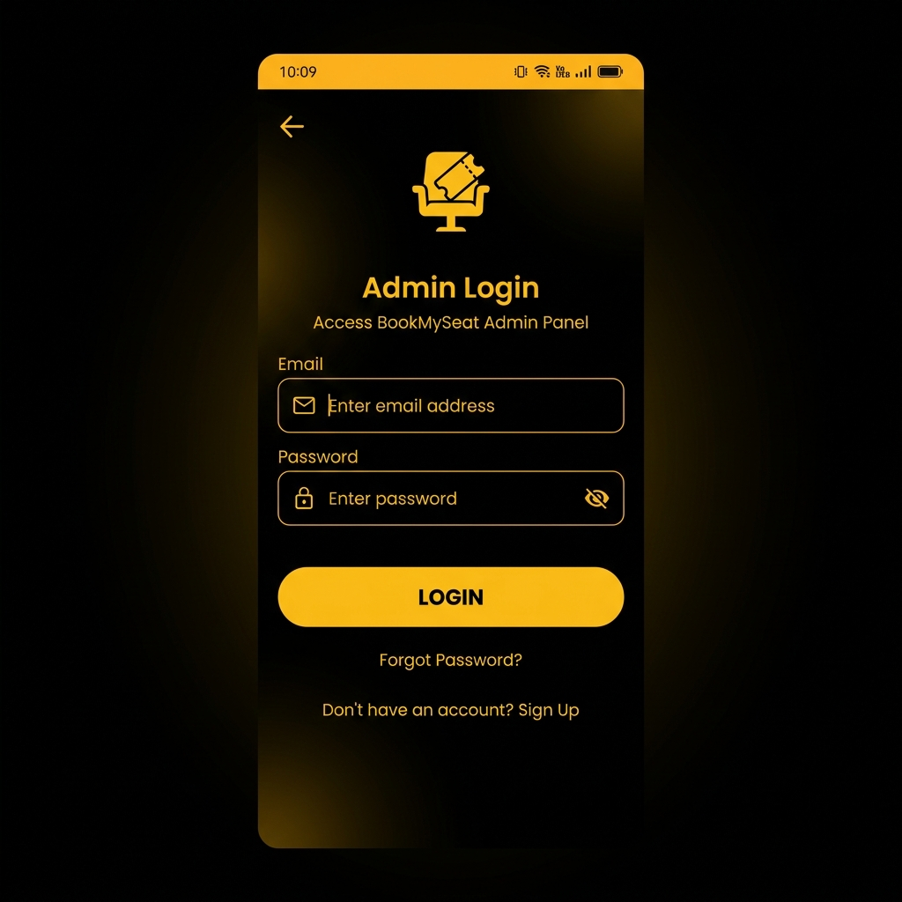
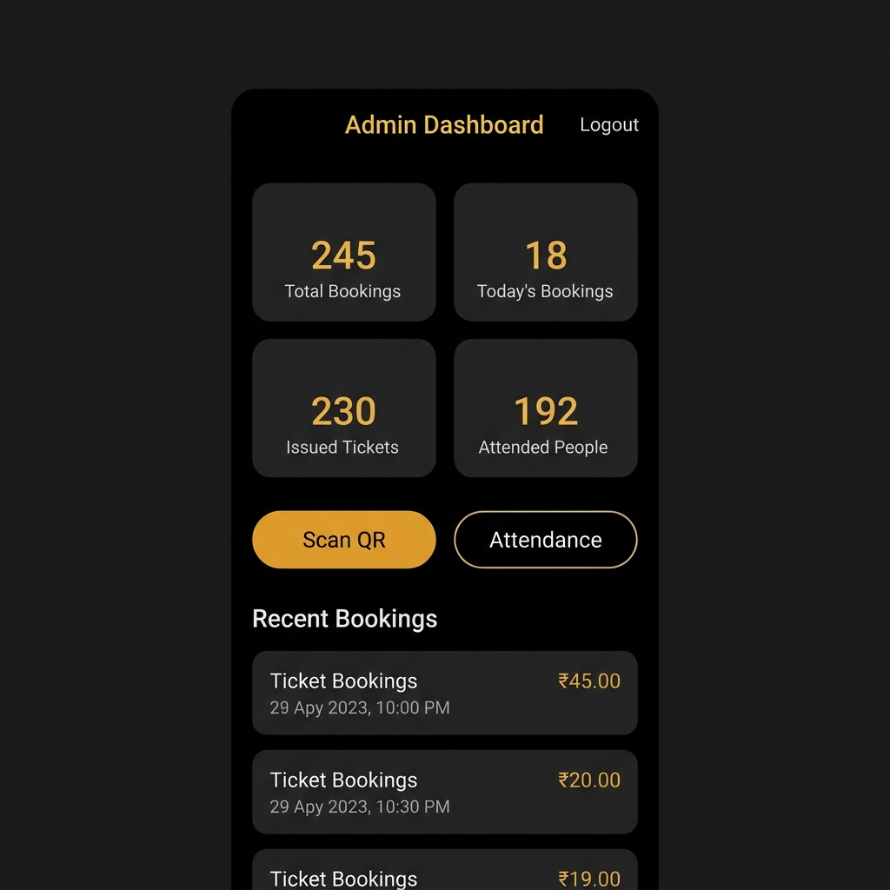
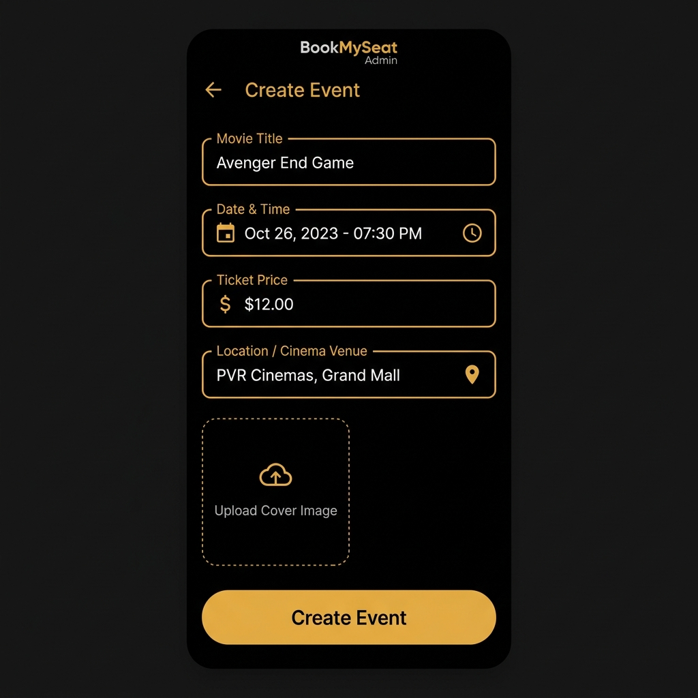

# BookMySeat Admin App (BookMySeat පරිපාලක යෙදුම)

[](https://developer.android.com)
[](https://firebase.google.com)
[](https://www.oracle.com/java/)

An elegant, high-performance Android-based Admin Dashboard application for the **BookMySeat** platform. This app empowers administrators and event coordinators to manage movie screenings, events, track ticket bookings, scan QR codes for attendance, and analyze real-time ticket sales.

**BookMySeat** යනු සිනමා ශාලා සහ විවිධ උත්සව සඳහා ආසන වෙන්කිරීම් කළමනාකරණය කරන පද්ධතියක පරිපාලක (Admin) ජංගම දුරකථන යෙදුමයි. මෙමඟින් නව උත්සව ඇතුළත් කිරීම, ප්‍රවේශ පත්‍ර (Tickets) පරීක්ෂා කිරීම සඳහා QR කේත ස්කෑන් කිරීම, සහ ආදායම් වාර්තා තථ්‍ය කාලීනව (Real-time) නිරීක්ෂණය කළ හැකිය.

---

## 📸 Screenshots (සංදර්ශන රූප)

Here are the sample user interfaces generated based on the application code layout:

මෙන්න මෙම යෙදුමේ ප්‍රධාන පිටුවල සැලසුම් (Mockups):

<p align="center">
  
  
  
</p>

*Left to Right: Admin Login, Admin Dashboard, Create Event Screen.*

---

## 🚀 Key Features (ප්‍රධාන අංග)

### 1. **Secure Admin Authentication (ආරක්ෂිත පරිපාලක පිවිසුම)**
- Email & password authentication handled via **Firebase Auth**.
- Role-based authorization: Checks if the user exists in the Firestore `admins` collection and verifies their role (`super_admin` vs. regular event coordinator).
- **Firebase Auth** හරහා සිදුවන ආරක්ෂිත පිවිසුම. Firestore `admins` collection එක මඟින් පරිශීලකයා `super_admin` කෙනෙක්ද නැතහොත් සාමාන්‍ය admin කෙනෙක්ද යන්න තහවුරු කරයි.

### 2. **Real-time Analytics Dashboard (තථ්‍ය කාලීන උපකරණ පුවරුව)**
- Real-time display of:
  - **Total Bookings** (මුළු වෙන්කිරීම්)
  - **Today's Bookings** (අද දින වෙන්කිරීම්)
  - **Tickets Issued** (නිකුත් කළ ප්‍රවේශ පත්‍ර)
  - **Attended Attendees** (සහභාගී වූ පුද්ගලයින්)
- Displays a scrollable list of recent ticket bookings with navigation to detailed views.
- තථ්‍ය කාලීනව වෙන්කිරීම් සංඛ්‍යාවන් සහ මෑතකදී සිදු වූ වෙන්කිරීම් ලැයිස්තුවක් පෙන්වයි.

### 3. **Event Management (උත්සව කළමනාකරණය)**
- Create and edit events with:
  - Movie / Event title & Category
  - Date and time picker
  - Ticket price structure
  - Location/Venue details with Google Maps integration
  - Event cover image upload (via image picker)
- නව උත්සව හෝ සිනමා දර්ශන ඇතුළත් කිරීම සහ සංස්කරණය කිරීම. Google Maps ආධාරයෙන් ස්ථානය තේරීම සහ පින්තූර ඇතුළත් කිරීම මෙහිදී සිදුකළ හැක.

### 4. **QR Code Attendance Verification (QR කේත මඟින් පැමිණීම සලකුණු කිරීම)**
- Integrated barcode/QR scanner (using `zxing-android-embedded`) to scan booking QR codes on user tickets.
- Instantly updates attendance status in Firestore.
- පරිශීලකයන්ගේ දුරකථනවල ඇති QR කේත ස්කෑන් කර ඔවුන් පැමිණි බව (Attendance) තත්පරයකින් Firestore database එකෙහි යාවත්කාලීන කරයි.

### 5. **Location Picker (ස්ථාන තේරීම)**
- Integrates Google Maps SDK and Google Places SDK to allow admin users to search and pinpoint event coordinates.
- Google Maps SDK ආධාරයෙන් උත්සවය පවත්වන ස්ථානය සිතියම මත ලකුණු කිරීමට හැක.

---

## 🛠 Tech Stack (තාක්ෂණික මෙවලම්)

- **Language:** Java (JDK 11)
- **Minimum SDK:** Android 28 (Pie)
- **Target SDK:** Android 36 (16)
- **Backend Database & Auth:** Firebase Firestore, Firebase Authentication
- **Libraries used:**
  - Google Play Services (Maps, Location, Places)
  - ZXing Embedded (Barcode/QR scanner)
  - Dhaval2404 Image Picker (Easy profile/cover upload)
  - Material Design Components for elegant dark-theme styling.

---

## ⚙️ Setup Instructions (ස්ථාපන උපදෙස්)

To run this project on your local machine:

මෙම යෙදුම ඔබේ පරිගණකයේ ක්‍රියාත්මක කිරීමට:

### 1. **Clone the Repository (පිටපත් කරගන්න)**
```bash
git clone https://github.com/hashboy5130/BookMySeatAdmin.git
```

### 2. **Firebase Setup (Firebase සබැඳියාව)**
1. Go to [Firebase Console](https://console.firebase.google.com/).
2. Create a new project named `BookMySeat`.
3. Register your Android app with package name `com.hash.bookmyseatadmin`.
4. Download the `google-services.json` file and place it inside the `app/` directory of this project.
5. Enable **Email/Password Provider** in Firebase Auth.
6. Set up **Cloud Firestore** and create an `admins` collection with a sample document structure containing admin emails and their roles.

### 3. **Google Maps API Key Setup (Google Maps යතුර සකසන්න)**
Open `app/src/main/AndroidManifest.xml` and replace or check the Google Maps API Key metadata tag:
```xml
<meta-data
    android:name="com.google.android.geo.API_KEY"
    android:value="YOUR_API_KEY_HERE" />
```

> [!WARNING]
> **Security Warning:** Never expose your actual Google Maps API Key in a public Git repository. It is highly recommended to secure the key by saving it inside `local.properties` (which is excluded from Git tracking) and loading it via the secrets-gradle-plugin.
> 
> **ආරක්ෂක අවවාදයයි:** ඔබගේ Google Maps API Key එක කිසිවිටෙකත් public Git repository එකක ප්‍රසිද්ධ කරන්න එපා. එය `local.properties` ගොනුවේ සුරැකීමට කටයුතු කරන්න.

### 4. **Run Application (ධාවනය කරන්න)**
Open the project in **Android Studio**, sync Gradle dependencies, connect your Android device or Emulator, and click **Run**.

---

## 📂 Project Structure (ව්යුහය)

```text
bookmyseatadmin/
├── app/
│   ├── src/
│   │   ├── main/
│   │   │   ├── java/com/hash/bookmyseatadmin/
│   │   │   │   ├── activity/        # Login, Dashboard, CreateEvent, QRScan, etc.
│   │   │   │   ├── adapter/         # Recycler adapters for Bookings and Events
│   │   │   │   ├── config/          # Configurations and constants
│   │   │   │   ├── model/           # Data models (AdminBooking, Event, etc.)
│   │   │   │   └── MyApplication.java
│   │   │   ├── res/
│   │   │   │   ├── layout/          # XML User Interface designs
│   │   │   │   └── values/          # colors.xml, themes.xml (Dark mode setups)
│   │   │   └── AndroidManifest.xml
│   │   └── build.gradle
│   └── .gitignore
├── screenshots/                 # UI Mockup images for documentation
├── build.gradle
└── README.md
```

---

## 🤝 Contribution & License

Feel free to fork this repository, submit Pull Requests, or file issues for bug fixes and feature enhancements.
Developed and maintained by **[hashboy5130](https://github.com/hashboy5130)**.

© 2026 BookMySeat. All rights reserved.
